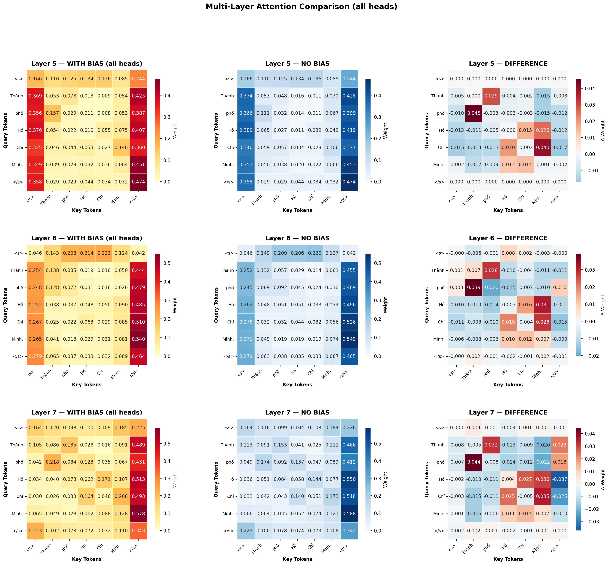

# HuTieuBERT Attention Visualization

Visualize and compare attention heatmaps across layers of **HuTieuBERT** with and without bias.

---

## How to Run

### 1. Clone the repository
```bash
git clone https://github.com/TracDucAnh/HuTieuBert.git
cd HuTieuBert
```

### 2. Create a virtual environment

```bash
python -m venv venv
```

### 3. Activate the environment
- Window
    ```bash
    venv\Scripts\activate
    ```
- MacOS, Linux
    ```bash
    source venv/bin/activate
    ```
### 4. Install dependencies

```bash
pip install -r requirements.txt
```

### 5. Run the script

```bash
python observe_changes.py
```

## To modify visualization configurations
In observe_changes.py
```python
layers_to_visualize = [5]   # <-- config layer bias list
heads = list(range(12))        # apply bias to all heads
```

## To modify how strong bias matrix effect to the overall attention scores
In observe_changes.py
```python
alpha_config = 0.5 # <-- strengthen attention scores inside a compound word 
beta_config = -0.25 # <-- weaken attention scores among compounds
gamma_config = 0.0 # <-- bias single token
delta_config = 0.0 # <-- bias self token
```

## To view the differences, go to figs/ - which contains visualization images


---

### Acknowledgement
This work makes use of **VnCoreNLP** — a Vietnamese natural language processing toolkit.

Copyright (C) 2018-2019 VnCoreNLP  
This program is free software: you can redistribute it and/or modify  
it under the terms of the GNU General Public License as published by  
the Free Software Foundation, either version 3 of the License, or  
(at your option) any later version.

This program is distributed in the hope that it will be useful,  
but **WITHOUT ANY WARRANTY**; without even the implied warranty of  
**MERCHANTABILITY or FITNESS FOR A PARTICULAR PURPOSE.**  
See the [GNU General Public License](https://www.gnu.org/licenses/) for more details.

Repository: [https://github.com/vncorenlp/VnCoreNLP](https://github.com/vncorenlp/VnCoreNLP)